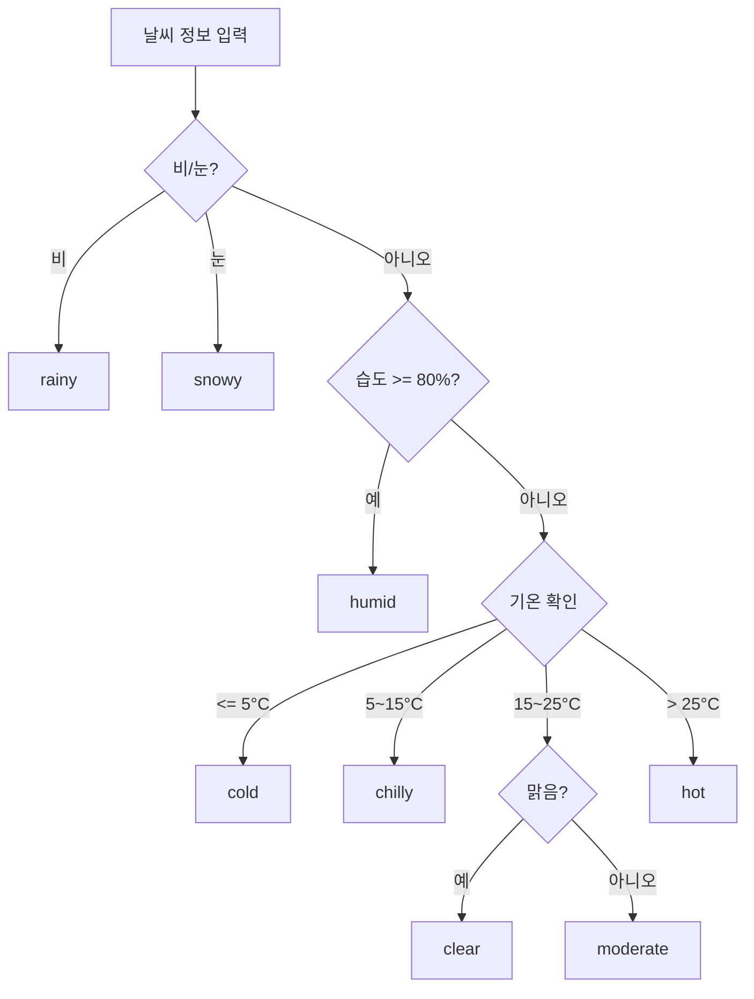

# ⚙️ FR-002: 날씨 기반 음식 추천

## 📋 문서 정보

| 항목 | 내용 |
|------|------|
| **기능 ID** | FR-002 |
| **버전** | 1.0 |
| **작성일** | 2024년 12월 4일 |
| **우선순위** | 🔴 필수 |
| **예상 공수** | 2일 |
| **상태** | 📝 작성완료 |

---

## 🎯 기능 개요

| 항목 | 내용 |
|------|------|
| **기능명** | 날씨 기반 음식 추천 |
| **설명** | 현재 날씨 조건(기온, 날씨 상태, 습도)에 따라 적합한 음식 카테고리를 추천 |
| **입력** | 날씨 정보 (WeatherInfo) |
| **출력** | 추천 음식 카테고리 목록 + 검색 키워드 |

---

## 🔗 관련 문서

| 문서 | 역할 |
|------|------|
| [US-001](../user-stories/US-001.md) | 관련 사용자 스토리 |
| [FR-001](./FR-001.md) | 선행 기능 (날씨 조회) |
| [FR-003](./FR-003.md) | 후행 기능 (음식점 검색) |
| [design_system.md](../../design_system.md) | UI 디자인 가이드 |
| [DEVELOPMENT_GUIDE.md](../../DEVELOPMENT_GUIDE.md) | 개발 가이드 |

---

## 🗂️ 데이터 모델

### FoodRecommendation 타입

```typescript
// types/food.ts

/**
 * 음식 카테고리 정보
 */
export interface FoodCategory {
  id: string;           // 카테고리 ID
  name: string;         // 카테고리명 (한글)
  emoji: string;        // 이모지
  keywords: string[];   // 검색 키워드 목록
  description: string;  // 카테고리 설명
}

/**
 * 음식 추천 결과
 */
export interface FoodRecommendation {
  weatherCondition: string;     // 날씨 조건 설명
  primaryCategory: FoodCategory; // 주 추천 카테고리
  alternativeCategories: FoodCategory[]; // 대안 카테고리
  reasonText: string;           // 추천 이유
}

/**
 * 날씨 조건 타입
 */
export type WeatherConditionType = 
  | 'rainy'     // 비 오는 날
  | 'snowy'     // 눈 오는 날
  | 'cold'      // 추운 날 (5°C 이하)
  | 'chilly'    // 쌀쌀한 날 (5~15°C)
  | 'moderate'  // 적당한 날 (15~25°C)
  | 'hot'       // 더운 날 (25°C 이상)
  | 'humid'     // 습한 날 (80% 이상)
  | 'clear';    // 맑은 날
```

---

## 🍜 날씨-음식 매핑 규칙

### 매핑 테이블 정의

```typescript
// configs/foodMappings.ts

export const FOOD_CATEGORIES: Record<string, FoodCategory> = {
  soup: {
    id: 'soup',
    name: '따뜻한 국물',
    emoji: '🍲',
    keywords: ['국밥', '찌개', '탕', '국물요리'],
    description: '몸을 따뜻하게 해주는 국물 요리',
  },
  noodle_hot: {
    id: 'noodle_hot',
    name: '따뜻한 면요리',
    emoji: '🍜',
    keywords: ['라멘', '우동', '칼국수', '짬뽕'],
    description: '김이 모락모락 나는 면요리',
  },
  hotpot: {
    id: 'hotpot',
    name: '전골/샤브샤브',
    emoji: '🫕',
    keywords: ['샤브샤브', '부대찌개', '전골', '어묵탕'],
    description: '함께 나눠먹는 뜨끈한 전골',
  },
  hearty: {
    id: 'hearty',
    name: '든든한 한식',
    emoji: '🍚',
    keywords: ['설렁탕', '감자탕', '삼계탕', '곰탕'],
    description: '속이 든든해지는 보양식',
  },
  comfort: {
    id: 'comfort',
    name: '따뜻한 밥/면',
    emoji: '🥘',
    keywords: ['쌀국수', '제육볶음', '덮밥', '비빔밥'],
    description: '편안하게 즐기는 따뜻한 식사',
  },
  variety: {
    id: 'variety',
    name: '다양한 선택',
    emoji: '🍝',
    keywords: ['파스타', '피자', '한식', '분식'],
    description: '다양하게 즐길 수 있는 날',
  },
  cold: {
    id: 'cold',
    name: '시원한 음식',
    emoji: '🥗',
    keywords: ['냉면', '밀면', '초밥', '샐러드'],
    description: '더위를 식혀주는 시원한 음식',
  },
  refreshing: {
    id: 'refreshing',
    name: '개운한 음식',
    emoji: '🍃',
    keywords: ['물냉면', '냉모밀', '회', '샐러드'],
    description: '후텁지근함을 날려주는 개운한 음식',
  },
  outdoor: {
    id: 'outdoor',
    name: '야외 식사',
    emoji: '☀️',
    keywords: ['브런치', '카페', '베이커리', '테라스'],
    description: '화창한 날 즐기는 야외 식사',
  },
};

export const WEATHER_FOOD_MAPPINGS: Record<WeatherConditionType, {
  primary: string;
  alternatives: string[];
  reason: string;
}> = {
  rainy: {
    primary: 'soup',
    alternatives: ['noodle_hot', 'hotpot'],
    reason: '비 오는 날엔 따뜻한 국물이 생각나요',
  },
  snowy: {
    primary: 'hotpot',
    alternatives: ['soup', 'noodle_hot'],
    reason: '눈 오는 날엔 뜨끈한 전골이 딱이에요',
  },
  cold: {
    primary: 'hearty',
    alternatives: ['soup', 'hotpot'],
    reason: '추운 날엔 속이 든든해지는 음식이 좋아요',
  },
  chilly: {
    primary: 'comfort',
    alternatives: ['noodle_hot', 'variety'],
    reason: '쌀쌀한 날엔 따뜻한 음식이 좋아요',
  },
  moderate: {
    primary: 'variety',
    alternatives: ['outdoor', 'comfort'],
    reason: '날씨가 좋아 뭘 먹어도 맛있는 날이에요',
  },
  hot: {
    primary: 'cold',
    alternatives: ['refreshing'],
    reason: '더운 날엔 시원한 음식이 최고예요',
  },
  humid: {
    primary: 'refreshing',
    alternatives: ['cold'],
    reason: '습한 날엔 개운한 음식이 좋아요',
  },
  clear: {
    primary: 'outdoor',
    alternatives: ['variety'],
    reason: '맑은 날 야외에서 즐기는 식사 어때요?',
  },
};
```

---

## 🏗️ 구현 명세

### 디렉토리 구조

```
src/
├── services/
│   └── recommendation/
│       ├── index.ts
│       ├── recommendationService.ts
│       └── recommendationUtils.ts
├── configs/
│   └── foodMappings.ts          # 매핑 설정
├── hooks/
│   └── useFoodRecommendation.ts # 추천 Hook
├── components/
│   └── food/
│       ├── FoodCategoryChips.tsx # 카테고리 칩 목록
│       └── FoodCategoryChip.tsx  # 개별 칩
└── types/
    └── food.ts                   # 타입 정의
```

### 날씨 조건 판단 로직

```typescript
// services/recommendation/recommendationUtils.ts
import type { WeatherInfo } from '@/types/weather';
import type { WeatherConditionType } from '@/types/food';

/**
 * 날씨 정보로부터 날씨 조건 타입을 판단합니다.
 */
export function determineWeatherCondition(weather: WeatherInfo): WeatherConditionType {
  const { main: weatherMain } = weather.weather;
  const { temp, humidity } = weather.current;

  // 1순위: 날씨 상태 확인
  if (weatherMain === 'Rain' || weatherMain === 'Drizzle' || weatherMain === 'Thunderstorm') {
    return 'rainy';
  }
  if (weatherMain === 'Snow') {
    return 'snowy';
  }

  // 2순위: 습도 확인 (80% 이상)
  if (humidity >= 80) {
    return 'humid';
  }

  // 3순위: 기온 확인
  if (temp <= 5) {
    return 'cold';
  }
  if (temp > 5 && temp <= 15) {
    return 'chilly';
  }
  if (temp > 15 && temp <= 25) {
    // 맑은 날이면 outdoor, 아니면 moderate
    if (weatherMain === 'Clear') {
      return 'clear';
    }
    return 'moderate';
  }
  if (temp > 25) {
    return 'hot';
  }

  return 'moderate';
}
```

### 추천 서비스

```typescript
// services/recommendation/recommendationService.ts
import type { WeatherInfo } from '@/types/weather';
import type { FoodRecommendation, FoodCategory } from '@/types/food';
import { FOOD_CATEGORIES, WEATHER_FOOD_MAPPINGS } from '@/configs/foodMappings';
import { determineWeatherCondition } from './recommendationUtils';

export const recommendationService = {
  /**
   * 날씨 기반 음식 추천
   * @param weather - 날씨 정보
   * @returns 추천 결과
   */
  getFoodRecommendation(weather: WeatherInfo): FoodRecommendation {
    const condition = determineWeatherCondition(weather);
    const mapping = WEATHER_FOOD_MAPPINGS[condition];

    const primaryCategory = FOOD_CATEGORIES[mapping.primary];
    const alternativeCategories = mapping.alternatives.map(
      (id) => FOOD_CATEGORIES[id]
    );

    return {
      weatherCondition: condition,
      primaryCategory,
      alternativeCategories,
      reasonText: mapping.reason,
    };
  },

  /**
   * 모든 카테고리 목록 반환
   */
  getAllCategories(): FoodCategory[] {
    return Object.values(FOOD_CATEGORIES);
  },

  /**
   * 특정 카테고리의 검색 키워드 반환
   */
  getSearchKeywords(categoryId: string): string[] {
    return FOOD_CATEGORIES[categoryId]?.keywords || [];
  },
};
```

### React Hook

```typescript
// hooks/useFoodRecommendation.ts
import { useMemo } from 'react';
import type { WeatherInfo } from '@/types/weather';
import { recommendationService } from '@/services/recommendation';

export const useFoodRecommendation = (weather: WeatherInfo | null) => {
  const recommendation = useMemo(() => {
    if (!weather) return null;
    return recommendationService.getFoodRecommendation(weather);
  }, [weather]);

  return {
    recommendation,
    allCategories: recommendationService.getAllCategories(),
    getKeywords: recommendationService.getSearchKeywords,
  };
};
```

---

## 🎨 UI 컴포넌트 명세

### FoodCategoryChips 컴포넌트

```typescript
// components/food/FoodCategoryChips.tsx
interface FoodCategoryChipsProps {
  recommendation: FoodRecommendation;
  selectedCategoryId: string;
  onSelectCategory: (categoryId: string) => void;
}

export const FoodCategoryChips = ({
  recommendation,
  selectedCategoryId,
  onSelectCategory,
}: FoodCategoryChipsProps) => {
  const categories = [
    recommendation.primaryCategory,
    ...recommendation.alternativeCategories,
  ];

  return (
    <div className="space-y-2">
      <p className="text-sm text-gray-600">{recommendation.reasonText}</p>
      <div className="flex flex-wrap gap-2">
        {categories.map((category) => (
          <FoodCategoryChip
            key={category.id}
            category={category}
            isSelected={category.id === selectedCategoryId}
            isPrimary={category.id === recommendation.primaryCategory.id}
            onClick={() => onSelectCategory(category.id)}
          />
        ))}
      </div>
    </div>
  );
};
```

### UI 레이아웃

```
┌─────────────────────────────────────────────────┐
│  오늘 같은 날엔...                               │  ← 추천 문구
│  "비 오는 날엔 따뜻한 국물이 생각나요"            │  ← reason 텍스트
│                                                 │
│  [🍲 따뜻한 국물]  [🍜 면요리]  [🫕 전골]        │  ← 카테고리 칩
│       ⬆️                                        │
│    (선택됨)                                      │
└─────────────────────────────────────────────────┘
```

### 칩 스타일

```css
/* 기본 칩 */
.chip {
  @apply inline-flex items-center gap-2 px-4 py-2 rounded-full
         bg-white border border-gray-200
         text-sm font-medium text-gray-700
         transition-all cursor-pointer;
}

/* 선택된 칩 */
.chip-selected {
  @apply bg-primary text-white border-primary;
}

/* 주 추천 칩 (뱃지) */
.chip-primary {
  @apply ring-2 ring-primary ring-offset-2;
}
```

---

## ✅ 인수 조건

| ID | 조건 | 테스트 방법 |
|----|------|-----------|
| AC-1 | 비 오는 날 → 따뜻한 국물 추천 | 비 오는 날 데이터로 테스트 |
| AC-2 | 눈 오는 날 → 전골/샤브샤브 추천 | 눈 오는 날 데이터로 테스트 |
| AC-3 | 5°C 이하 → 든든한 한식 추천 | 저온 데이터로 테스트 |
| AC-4 | 25°C 이상 → 시원한 음식 추천 | 고온 데이터로 테스트 |
| AC-5 | 습도 80% 이상 → 개운한 음식 추천 | 고습도 데이터로 테스트 |
| AC-6 | 맑은 날 15~25°C → 야외 식사 추천 | 쾌청한 날 데이터로 테스트 |
| AC-7 | 추천 이유 텍스트가 표시됨 | UI 확인 |
| AC-8 | 주 추천 + 대안 카테고리 표시 | UI 확인 |
| AC-9 | 카테고리 클릭 시 선택 상태 변경 | 클릭 테스트 |
| AC-10 | 선택된 카테고리로 검색이 진행됨 | FR-003 연동 확인 |

---

## 🧪 테스트 케이스

### 단위 테스트

```typescript
// services/recommendation/recommendationService.test.ts
describe('recommendationService', () => {
  describe('getFoodRecommendation', () => {
    it('should recommend soup for rainy weather', () => {
      const weather = mockWeather({ main: 'Rain', temp: 15 });
      const result = recommendationService.getFoodRecommendation(weather);
      
      expect(result.primaryCategory.id).toBe('soup');
    });

    it('should recommend cold food for hot weather', () => {
      const weather = mockWeather({ main: 'Clear', temp: 30 });
      const result = recommendationService.getFoodRecommendation(weather);
      
      expect(result.primaryCategory.id).toBe('cold');
    });

    it('should recommend refreshing food for humid weather', () => {
      const weather = mockWeather({ main: 'Clouds', temp: 25, humidity: 85 });
      const result = recommendationService.getFoodRecommendation(weather);
      
      expect(result.primaryCategory.id).toBe('refreshing');
    });
  });
});

describe('determineWeatherCondition', () => {
  it('should return "rainy" for Rain weather', () => {
    const weather = mockWeather({ main: 'Rain', temp: 20 });
    expect(determineWeatherCondition(weather)).toBe('rainy');
  });

  it('should prioritize weather state over temperature', () => {
    const weather = mockWeather({ main: 'Rain', temp: 30 });
    expect(determineWeatherCondition(weather)).toBe('rainy');
  });
});
```

---

## 📊 날씨 조건 우선순위



---

## 변경 이력

| 버전 | 날짜 | 변경 내용 | 작성자 |
|------|------|----------|--------|
| 1.0 | 2024-12-04 | 최초 작성 | - |


