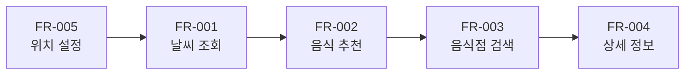

# 📚 개발 명세 문서 인덱스

## 📋 문서 정보

| 항목 | 내용 |
|------|------|
| **프로젝트** | 날씨 맞춤 음식점 추천 서비스 |
| **버전** | 1.0 |
| **최종 수정일** | 2024년 12월 4일 |

---

## 📖 관련 문서

| 문서 | 설명 | 경로 |
|------|------|------|
| 요구사항 명세서 | 서비스 개요, 기능 정의, 사용자 시나리오 | [request_1.md](../request_1.md) |
| UI 디자인 시스템 | 컬러, 타이포그래피, 컴포넌트 스타일 | [design_system.md](../design_system.md) |
| 개발 가이드 | 기술 스택, 코드 규칙, 패턴 | [DEVELOPMENT_GUIDE.md](../DEVELOPMENT_GUIDE.md) |

---

## 🎯 User Story 목록

사용자 관점의 기능 요구사항을 기술한 문서입니다.

| ID | 스토리명 | 관련 기능 | 상태 |
|----|---------|----------|------|
| [US-001](./user-stories/US-001.md) | 현재 위치에서 날씨 기반 음식점 추천받기 | FR-001, FR-002, FR-003 | 📝 작성완료 |
| [US-002](./user-stories/US-002.md) | 특정 위치 검색으로 음식점 추천받기 | FR-005, FR-001, FR-002, FR-003 | 📝 작성완료 |
| [US-003](./user-stories/US-003.md) | 음식점 상세 정보 확인 및 방문하기 | FR-004 | 📝 작성완료 |

---

## ⚙️ 기능 명세 목록

개발 단위별 상세 기능 명세서입니다. **최소 개발 단위**로 사용됩니다.

### Phase 1: 핵심 기능 (MVP)

| ID | 기능명 | 우선순위 | 예상 공수 | 상태 |
|----|--------|---------|----------|------|
| [FR-001](./features/FR-001.md) | 현재 위치 날씨 조회 | 🔴 필수 | 3일 | 📝 작성완료 |
| [FR-002](./features/FR-002.md) | 날씨 기반 음식 추천 | 🔴 필수 | 2일 | 📝 작성완료 |
| [FR-003](./features/FR-003.md) | 주변 음식점 검색 | 🔴 필수 | 4일 | 📝 작성완료 |
| [FR-004](./features/FR-004.md) | 음식점 상세 정보 조회 | 🔴 필수 | 3일 | 📝 작성완료 |
| [FR-005](./features/FR-005.md) | 사용자 위치 설정 | 🔴 필수 | 2일 | 📝 작성완료 |

### Phase 2: 확장 기능 (향후)

| ID | 기능명 | 우선순위 | 상태 |
|----|--------|---------|------|
| FR-006 | 5일 예보 기반 추천 | 🟡 선택 | ⏳ 대기 |
| FR-007 | 즐겨찾기 | 🟡 선택 | ⏳ 대기 |
| FR-008 | 방문 기록 | 🟡 선택 | ⏳ 대기 |

---

## 🔗 개발 순서 권장

### 권장 개발 순서

1. **FR-005**: 위치 설정 (GPS + 수동 입력)
2. **FR-001**: 날씨 조회 (OpenWeatherMap API 연동)
3. **FR-002**: 날씨 기반 음식 추천 로직
4. **FR-003**: 음식점 검색 (Google Places API 연동)
5. **FR-004**: 음식점 상세 정보 및 액션

---

## 📊 상태 범례

| 아이콘 | 의미 |
|--------|------|
| 📝 | 작성완료 |
| 🚧 | 개발중 |
| ✅ | 완료 |
| ⏳ | 대기 |
| ❌ | 취소 |

---

## 변경 이력

| 버전 | 날짜 | 변경 내용 | 작성자 |
|------|------|----------|--------|
| 1.0 | 2024-12-04 | 최초 작성 | - |

